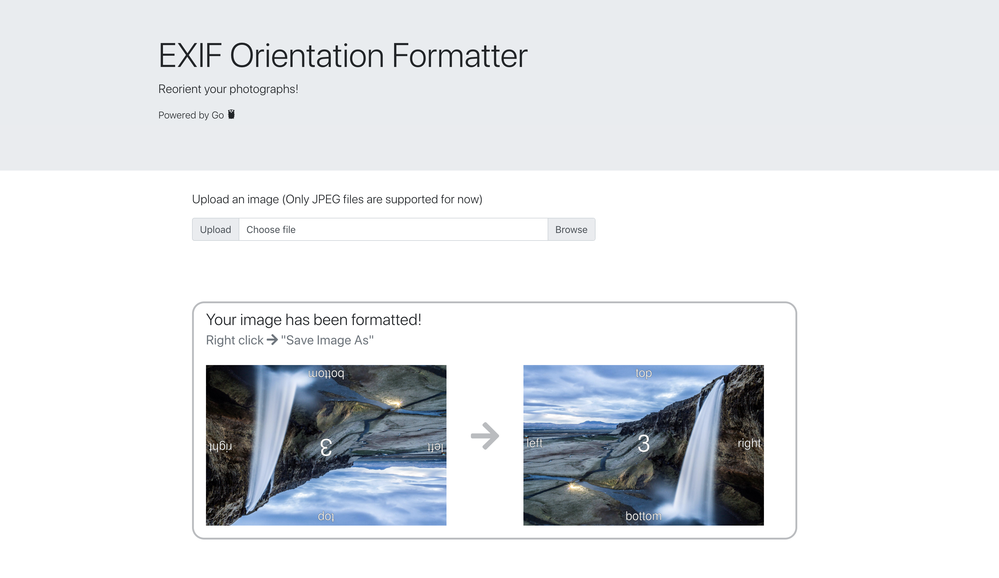

# React-Go Exif Formatter

## Exif Orientation Image Formatter

### This application reorients photographs / images based off of EXIF meta data

#### About
- The **EXIF Orientation Formatter** extracts an images meta data (learn more here: https://photographylife.com/what-is-exif-data) and returns an image with its corrected orientation

    

- The server is written in Go and utilizes rwcarlsen's EXIF decoding package to extract meta data(https://github.com/rwcarlsen/goexif/) 

### Software
- **React** The interface is built on React
- **Go** The server is written in Go 

### Author
- **Sasank Ganapathiraju**